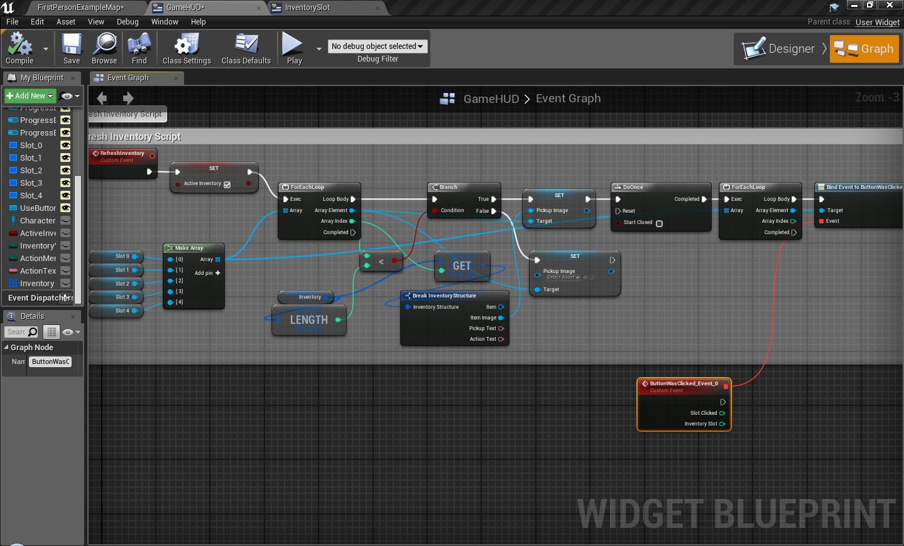

### +: Particles Monedas

### [GameHUD]
  DESIGNER +> VerticalBox "ActionMenu"(isVariable)
  
  GRAPH +> {"ActionMenuVisible" : ESlate Visibility} && DESIGNER Bind "ActionMenu">Visibility>Visiblity
  
  DESIGNER > "ActionMenu" > Anchor && ZOrder
  
  DESIGNER > {"UseButton", "DropButton", "CancelButton"} whith TEXT && "UseButton" > Text > text bind {"ActionText" : Text}
  
  GRAPH > {"Inventory" : InventoryStruct} AS Array
  
  GRAPH +> {"RefreshInventory" : Custom Event} ??? IMG "Refresh Inventory" 
  
